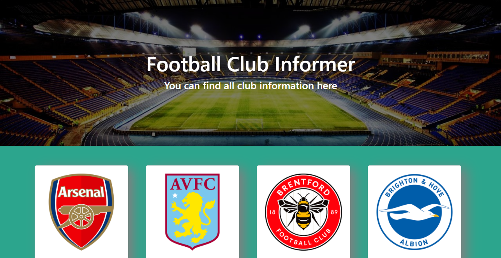
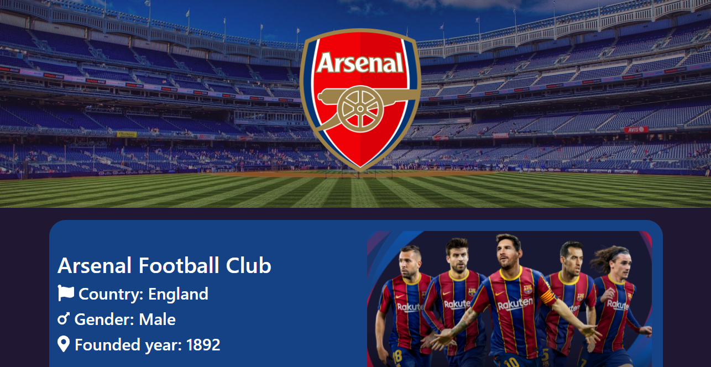

# [Football club Informar](https://frosty-poincare-bfe3fe.netlify.app/) | [Github](https://github.com/AbulBashar38/football-club-informar)
This react project is about some football club. You can know about all information of some Europe football club from this project. when you click button you can see a banner first fo the club. This will changes dynamically and this project is a responsive so you can use it on your mobile comfortable.
# Features
* Showing All Club name and logo in a card element of React JS.
* Showing All details of an club by clicking Explore button.
* Use API for showing Data
* Use Fontawesome
# Technology
* React JS
* HTML5
* CSS3
* Bootstrap
## Home page

## Details page

